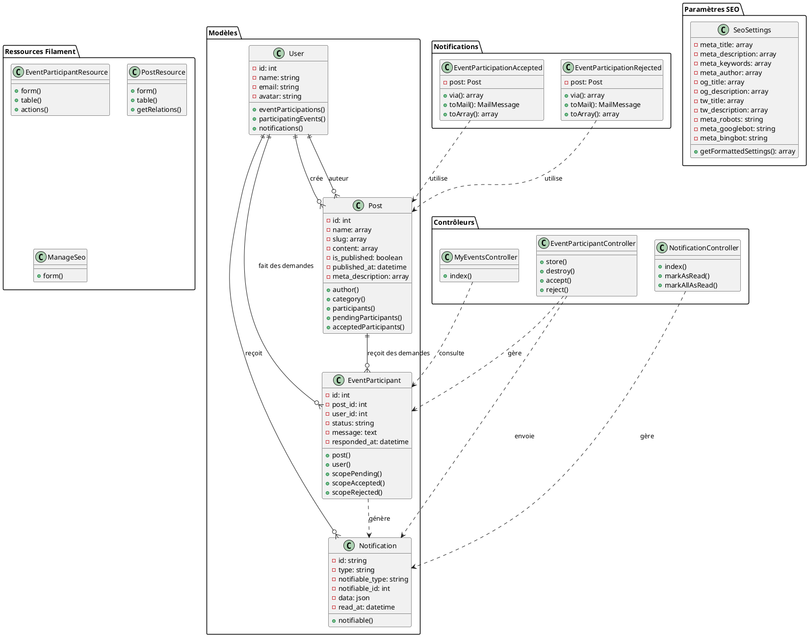
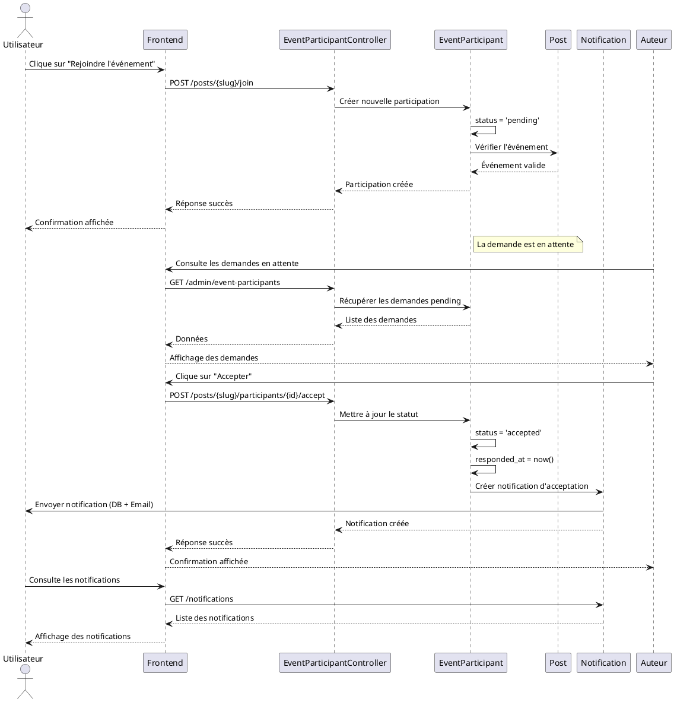
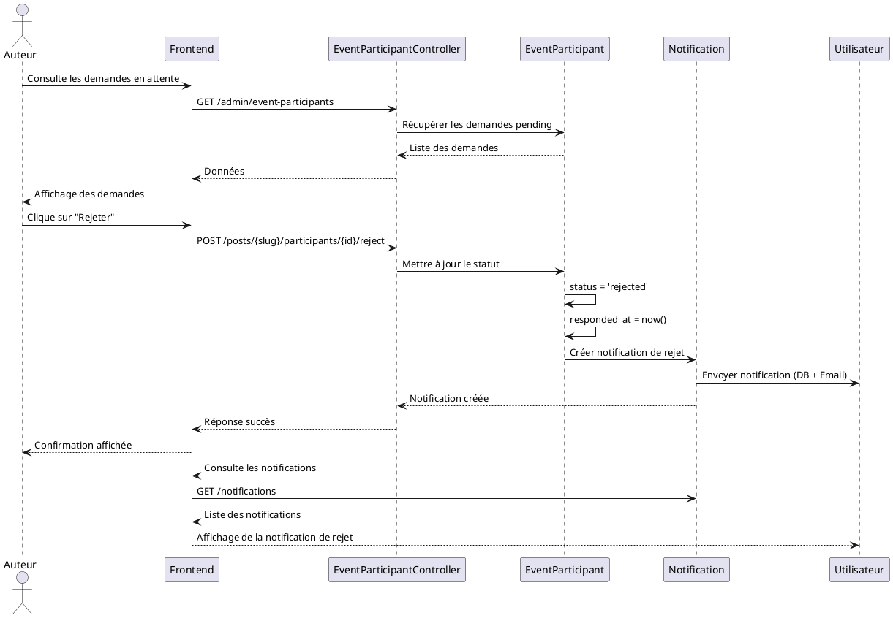
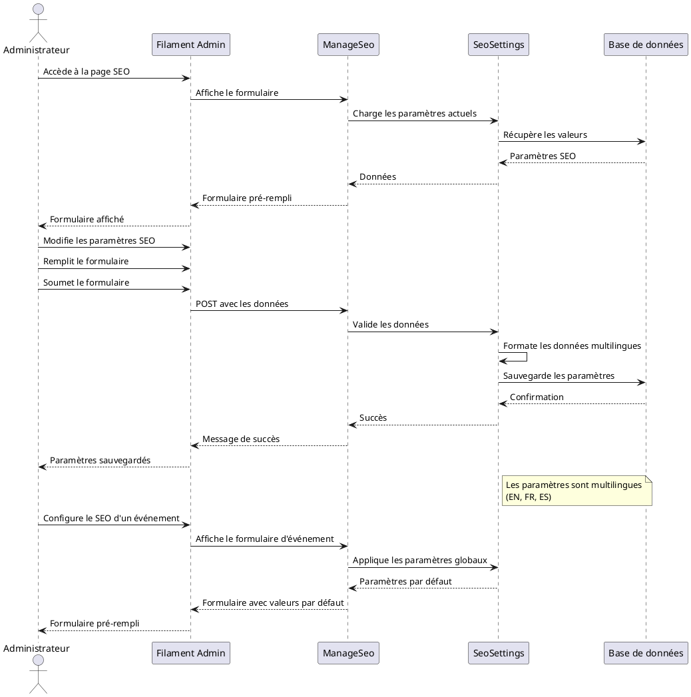
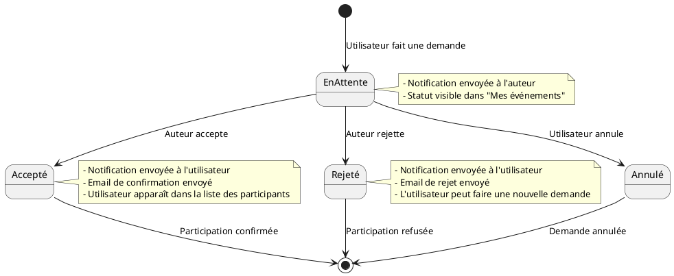
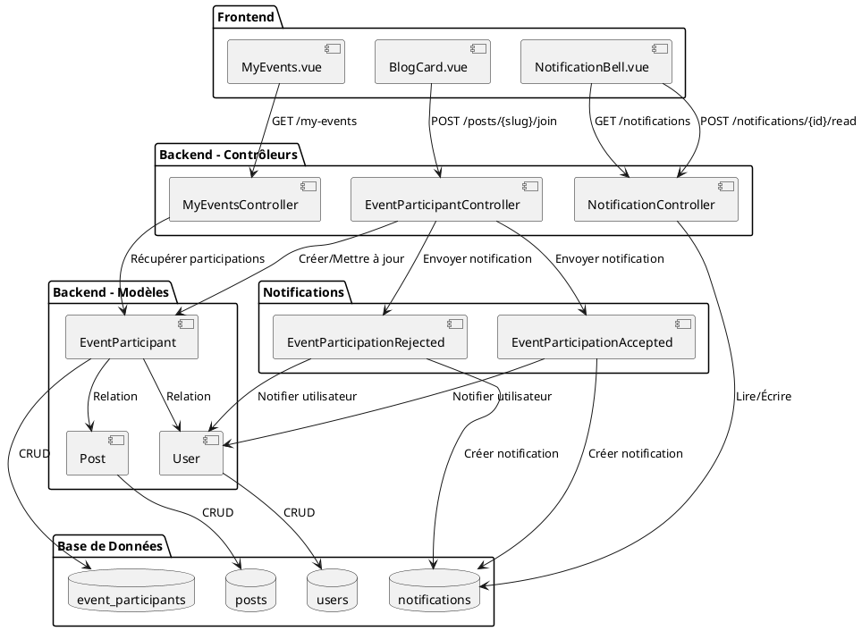

# Diagrammes UML - Fonctionnalités

Ce document contient les diagrammes PlantUML pour les fonctionnalités principales du système :
- **Notifications** (acceptation/rejet de participation)
- **Rejoindre un événement** (participation aux événements)
- **Paramètres SEO** (configuration et gestion)

## Diagramme de Classes



## Diagramme de Cas d'Utilisation

```plantuml
@startuml Diagramme de Cas d'Utilisation - Notifications, Participation et SEO

left to right direction

actor Utilisateur as User
actor Auteur as Author
actor Administrateur as Admin

rectangle "Système de Participation aux Événements" {
    usecase UC1 "Consulter la liste des événements" as UC1
    usecase UC2 "Rejoindre un événement" as UC2
    usecase UC3 "Annuler une demande de participation" as UC3
    usecase UC4 "Consulter mes événements" as UC4
    usecase UC5 "Voir le statut de ma demande" as UC5
}

rectangle "Système de Gestion des Participations" {
    usecase UC6 "Voir les demandes en attente" as UC6
    usecase UC7 "Accepter une demande" as UC7
    usecase UC8 "Rejeter une demande" as UC8
    usecase UC9 "Voir la liste des participants" as UC9
    usecase UC10 "Gérer les participants (admin)" as UC10
}

rectangle "Système de Notifications" {
    usecase UC11 "Recevoir une notification d'acceptation" as UC11
    usecase UC12 "Recevoir une notification de rejet" as UC12
    usecase UC13 "Consulter les notifications" as UC13
    usecase UC14 "Marquer une notification comme lue" as UC14
    usecase UC15 "Marquer toutes les notifications comme lues" as UC15
    usecase UC16 "Recevoir une notification par email" as UC16
}

rectangle "Système de Configuration SEO" {
    usecase UC17 "Configurer les paramètres SEO globaux" as UC17
    usecase UC18 "Définir le titre meta" as UC18
    usecase UC19 "Définir la description meta" as UC19
    usecase UC20 "Configurer les mots-clés" as UC20
    usecase UC21 "Configurer Open Graph" as UC21
    usecase UC22 "Configurer Twitter Cards" as UC22
    usecase UC23 "Configurer les robots meta" as UC23
    usecase UC24 "Optimiser le SEO d'un événement" as UC24
}

' Relations Utilisateur
User --> UC1
User --> UC2
User --> UC3
User --> UC4
User --> UC5
User --> UC13
User --> UC14
User --> UC15
User --> UC11
User --> UC12
User --> UC16

' Relations Auteur
Author --> UC1
Author --> UC6
Author --> UC7
Author --> UC8
Author --> UC9
Author --> UC24

' Relations Administrateur
Admin --> UC1
Admin --> UC6
Admin --> UC7
Admin --> UC8
Admin --> UC9
Admin --> UC10
Admin --> UC17
Admin --> UC18
Admin --> UC19
Admin --> UC20
Admin --> UC21
Admin --> UC22
Admin --> UC23
Admin --> UC24

' Relations entre cas d'utilisation
UC2 ..> UC11 : "déclenche"
UC7 ..> UC11 : "déclenche"
UC8 ..> UC12 : "déclenche"
UC11 ..> UC16 : "inclut"
UC12 ..> UC16 : "inclut"
UC24 ..> UC18 : "inclut"
UC24 ..> UC19 : "inclut"
UC24 ..> UC20 : "inclut"

@enduml
```

## Diagramme de Séquence - Rejoindre un Événement



## Diagramme de Séquence - Rejeter une Participation



## Diagramme de Séquence - Configuration SEO



## Diagramme d'État - Statut de Participation



## Diagramme de Composants - Architecture des Notifications



## Légende et Notes

### Modèles de Données

- **User** : Représente un utilisateur du système
- **Post** : Représente un événement/publication
- **EventParticipant** : Représente une demande de participation à un événement
- **Notification** : Représente une notification système
- **SeoSettings** : Représente les paramètres SEO globaux

### Statuts de Participation

- **pending** : Demande en attente de réponse
- **accepted** : Demande acceptée par l'auteur
- **rejected** : Demande rejetée par l'auteur

### Canaux de Notification

- **database** : Notification stockée en base de données
- **mail** : Notification envoyée par email

### Paramètres SEO

Les paramètres SEO sont multilingues et supportent :
- **EN** (Anglais)
- **FR** (Français)
- **ES** (Espagnol)

Chaque paramètre peut avoir une valeur différente selon la langue.

---

*Généré avec PlantUML - Pour visualiser ces diagrammes, utilisez un plugin PlantUML dans votre IDE ou visitez [plantuml.com](http://www.plantuml.com/plantuml/uml/)*

